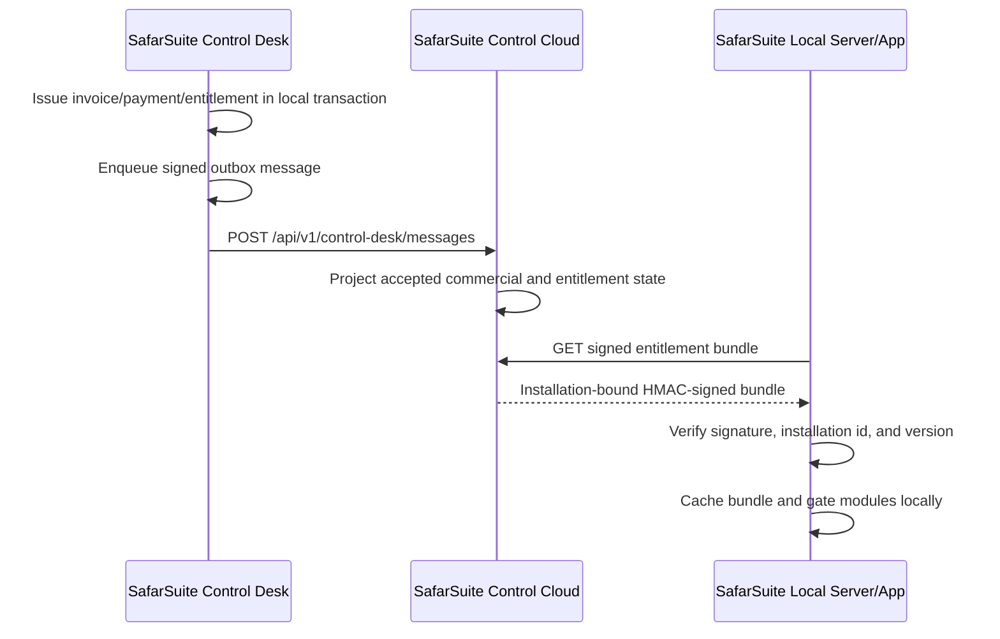
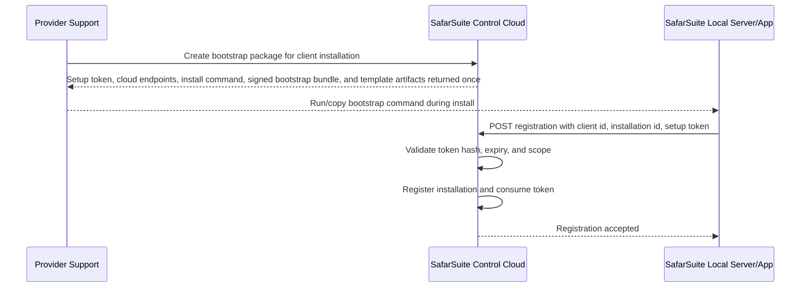
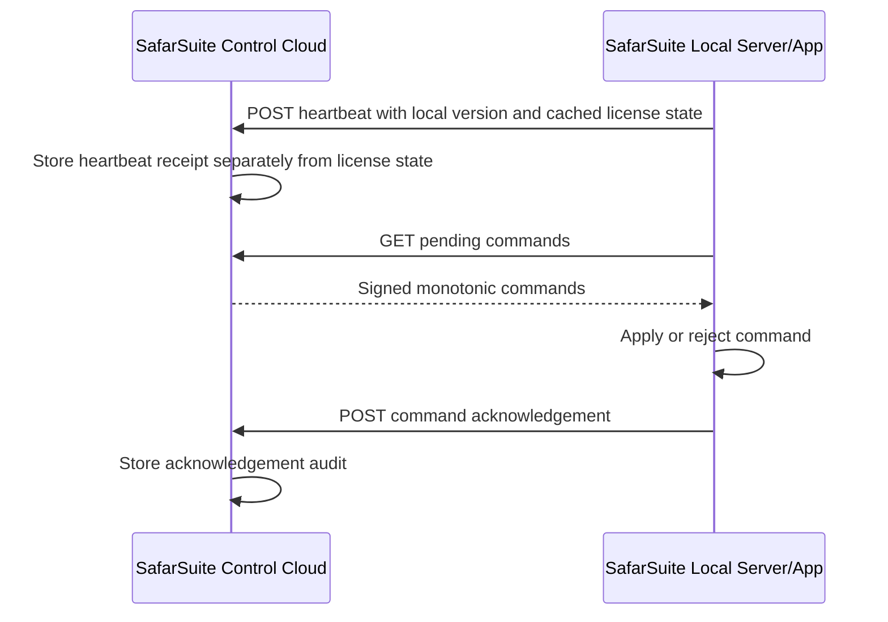
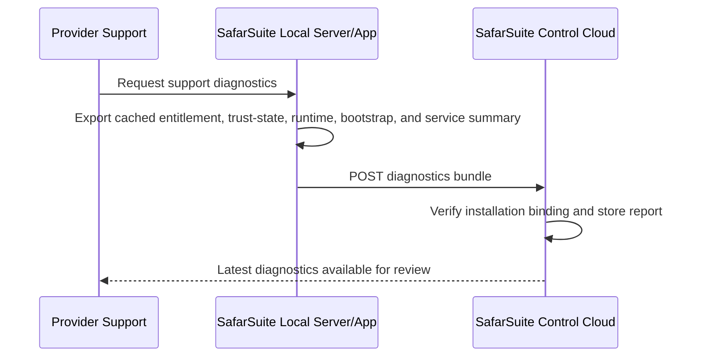
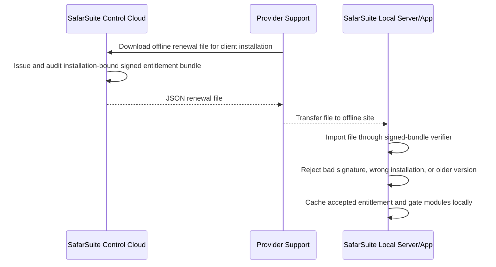

# Cloud And Local Communication Map

Date added: 2026-07-02

Use this as the canonical alignment note for SafarSuite Control Desk, SafarSuite Control Cloud, SafarSuite Client Portal, and deployed SafarSuite local servers.

Related runtime boundary note:

```text
docs/architecture/safarsuite-runtime-integration-boundary.md
docs/architecture/client-deployment-and-data-sync-boundary.md
```

## System Roles

| System | Role | Owns |
| --- | --- | --- |
| SafarSuite Control Desk | Internal office app | Client setup, contracts, invoices, payments, accounting decisions, entitlement snapshots, local operational truth |
| SafarSuite Control Cloud | Online control plane | Accepted commercial projection, signed entitlement bundles, installation registry, command queue, heartbeat records, cloud audit |
| SafarSuite Client Portal | Client-facing portal | Cloud-owned summaries, invoices/balances, license/deployment visibility, approved client self-service |
| SafarSuite local server/app | Client deployment | Cached signed entitlement, local feature gates, outbound heartbeat, command pull/acknowledgement |

There is one production SafarSuite Control Cloud. Older CloudServer work is reference material only, not a second production cloud.

## Source Of Truth

| Data | Source of truth | Replication path |
| --- | --- | --- |
| Client commercial setup | Control Desk | Signed outbox envelope to Control Cloud |
| Product module catalog | Control Desk config for now, later provider/cloud managed | Contracts and entitlements reference module codes from the catalog; signed bundles remain the runtime enforcement source |
| Invoice/payment/credit/refund state | Control Desk | Signed outbox envelope to Control Cloud |
| Latest client portal commercial summary | Control Cloud | Projection from accepted Control Desk envelopes |
| Signed entitlement bundle | Control Cloud | Local server pulls over HTTPS and verifies locally |
| License/access decision at runtime | SafarSuite local server/app | Uses cached signed entitlement without requiring heartbeat |
| Heartbeat/last seen | Control Cloud | Local server reports outbound heartbeat |
| Pending local-server commands | Control Cloud | Local server pulls pending commands and acknowledges results |
| Installation control status view | Control Cloud | Control Desk and Client Portal read one shared cloud status response |
| Client Portal sessions | Control Cloud | Client users authenticate to Control Cloud and receive client-scoped sessions |
| Client Portal invitations | Control Cloud | Control Desk requests, lists, resends, and revokes invites for client contacts through provider-key-protected cloud endpoints |
| Client Portal invitation/session audit | Control Cloud | Cloud audit recorder captures invite lifecycle, delivery, accept, login, and rejected-login events |
| Bootstrap mode | Control Cloud setup flow | `OnlineBootstrap` or `OfflineAssistedBootstrap`; this describes installation setup, not the client's runtime deployment shape |
| Client deployment mode | Control Desk decision, surfaced through Control Cloud installation/deployment profile | `OfflineLocal`, `BranchToHqSync`, `CloudSyncMultiBranch`, or `HostedSaas`; operational business-data sync remains outside this control channel |

## Active Communication Paths

| Direction | Purpose | Endpoint/Boundary | Status |
| --- | --- | --- | --- |
| Control Desk -> Control Cloud | Publish approved commercial/control events | `POST /api/v1/control-desk/messages` | Basic done |
| Control Cloud -> Client Portal | Client commercial summary | `GET /api/v1/client-portal/clients/{clientId}/commercial-summary` | Basic done |
| Control Desk -> Control Cloud | Manage client contact portal invitations | `POST /api/v1/clients/{clientId}/contacts/{clientContactId}/portal-invitation`, `GET/POST /api/v1/clients/{clientId}/portal-invitations...` -> provider-key-protected Control Cloud invitation endpoints | Basic done with pluggable delivery and audit |
| Local server -> Control Cloud | Pull latest signed entitlement bundle | `GET /api/v1/local-server/installations/{installationId}/entitlement-bundle?clientId={clientId}` | Basic done |
| Control Cloud admin -> Control Cloud | Queue installation command | `POST /api/v1/control-cloud/clients/{clientId}/installations/{installationId}/commands` | Basic done |
| Local server -> Control Cloud | Pull pending installation commands | `GET /api/v1/local-server/installations/{installationId}/commands/pending` | Basic done |
| Local server -> Control Cloud | Acknowledge command result | `POST /api/v1/local-server/installations/{installationId}/commands/{commandId}/acknowledgement` | Basic done |
| Local server -> Control Cloud | Report heartbeat and current cached license state | `POST /api/v1/local-server/installations/{installationId}/heartbeat` | Basic done |
| Local server -> Control Cloud | Register installation with one-time setup token | Provider creates `POST /api/v1/control-cloud/clients/{clientId}/installations/{installationId}/setup-token`; local server consumes `POST /api/v1/local-server/installations/{installationId}/registration` | Basic done |
| Control Cloud/Support -> Control Cloud | Generate local-server bootstrap package | `POST /api/v1/control-cloud/clients/{clientId}/installations/{installationId}/bootstrap-package` returns setup token, registration endpoints, copyable install command, signed bootstrap bundle metadata, and compose/env artifact checksums; `POST .../bootstrap-package/download` returns the signed JSON bundle artifact | Basic done |
| Control Cloud/Support -> Control Cloud | Review setup/bootstrap/registration audit trail | `GET /api/v1/control-cloud/audit-events?clientId={clientId}&eventType={eventType}` | Basic done |
| Control Desk/Client Portal -> Control Cloud | Read installation heartbeat, license, entitlement, and command status | `GET /api/v1/control-cloud/clients/{clientId}/installations/{installationId}/status` and `GET /api/v1/client-portal/clients/{clientId}/installations/{installationId}/status` | Basic portal preview done |
| Local server -> Control Cloud | Upload support diagnostics bundle | `POST /api/v1/local-server/installations/{installationId}/diagnostics`; support reads latest through `GET /api/v1/control-cloud/clients/{clientId}/installations/{installationId}/diagnostics/latest`; bundle includes entitlement/trust state plus runtime, Docker/Compose, bootstrap, service, and recent-error facts | Basic done |
| Control Cloud/Support -> Local server | Offline renewal file fallback | `GET /api/v1/control-cloud/clients/{clientId}/installations/{installationId}/offline-renewal-file`; local server imports wrapped signed bundle | Basic done |

## License And Heartbeat Rule

```text
heartbeat status != license validity
```

Heartbeat means the deployed local server is communicating with SafarSuite Control Cloud.

License validity comes from the signed entitlement bundle cached by the SafarSuite local server/app.

A paid offline-capable client must keep working through the signed entitlement period even when heartbeat is unavailable. Warnings, grace, restriction, and expiry come from the signed entitlement dates, not from missed heartbeat alone.

## Current License Flow



## Current Setup Registration Flow



## Current Heartbeat And Command Flow



## Current Diagnostics Flow



## Current Offline Renewal Fallback



## Guardrails For Future Work

- Do not call Control Cloud inside accounting transactions. Use durable outbox messages.
- Do not treat missed heartbeat as automatic license failure.
- Do not let SafarSuite local runtime depend on portal screens; it must verify signed bundles locally.
- Do not mix client business-data sync with billing/license control.
- Do not mix bootstrap mode with client deployment mode.
- Every entitlement issue, local entitlement import, command, acknowledgement, heartbeat, renewal file, setup/bootstrap action, registration attempt, and support override must be audited.
- Client Portal invitation and session activity must stay cloud-audited; Control Desk may request invites but must not own portal credentials.
- Local-server trust state, registration client, and cloud bootstrap package contract now exist in this workspace's shared licensing libraries; deployed SafarSuite app/runtime integration belongs in the SafarSuite app workspace when we reach installer, local UI, or service enforcement.
- Offline renewal files are fallback only. Direct outbound cloud pull is the normal path.
- Registration-bound entitlement pull is separated from Client Portal sessions; setup-token registration is now the normal installation binding path.
- Client Portal credentials must remain cloud-owned; Control Desk can trigger invitations for contacts but should not store client passwords.

## Current Status View

Control Cloud exposes one shared status response for Control Desk and Client Portal through:

```text
GET /api/v1/control-cloud/clients/{clientId}/installations/{installationId}/status
```

It reports installation identity, latest heartbeat, reported license state, latest signed entitlement issue, pending command count, latest command acknowledgement summary, and the stored deployment profile. The SafarSuite Control Desk client page has a minimal manual refresh panel, setup-token/bootstrap-package actions that use the saved deployment profile, a recent installation history view backed by Control Cloud audit events, and a read-only latest diagnostics view/download. The first SafarSuite Client Portal preview consumes the same cloud status through its portal route.

## Next Alignment Slice

Continue toward real SafarSuite image publication, deployed runtime log collection, and then SafarSuite app workspace changes for actual module-gateway enforcement inside the deployed app. Setup-token registration, Control Desk setup/bootstrap actions, Control Desk installation history and latest diagnostics visibility, low-risk command execution, signed bootstrap bundle/download generation, the first install script template, Docker Compose template artifacts, optional SafarSuite app runtime slot, runtime service manifest, setup/bootstrap/registration audit visibility, richer diagnostics export/upload, local import audit persistence, offline renewal export/import, and local clock/replay trust state now reuse the signed entitlement bundle trust chain.
