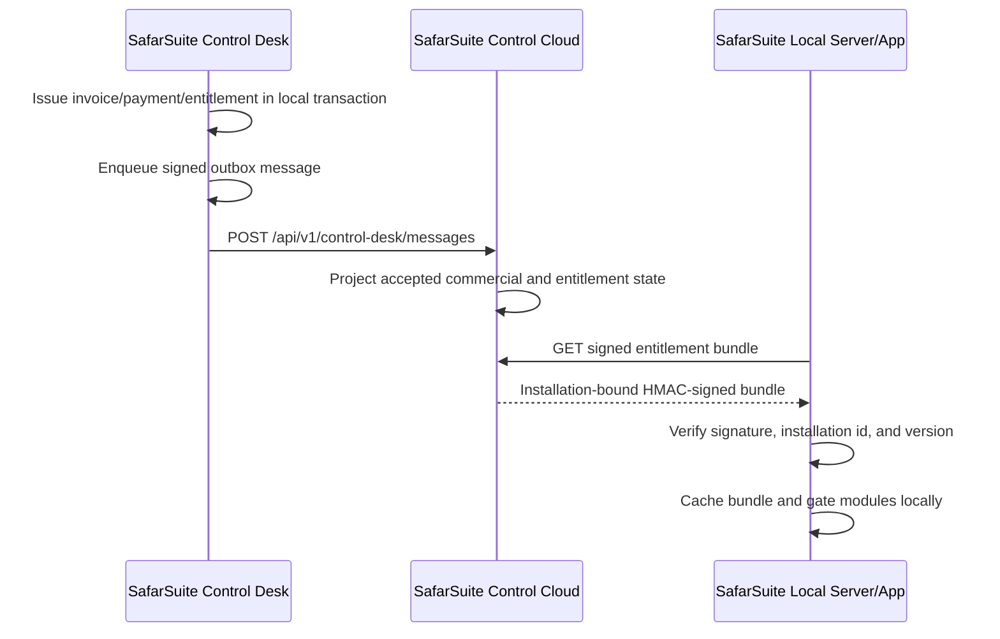
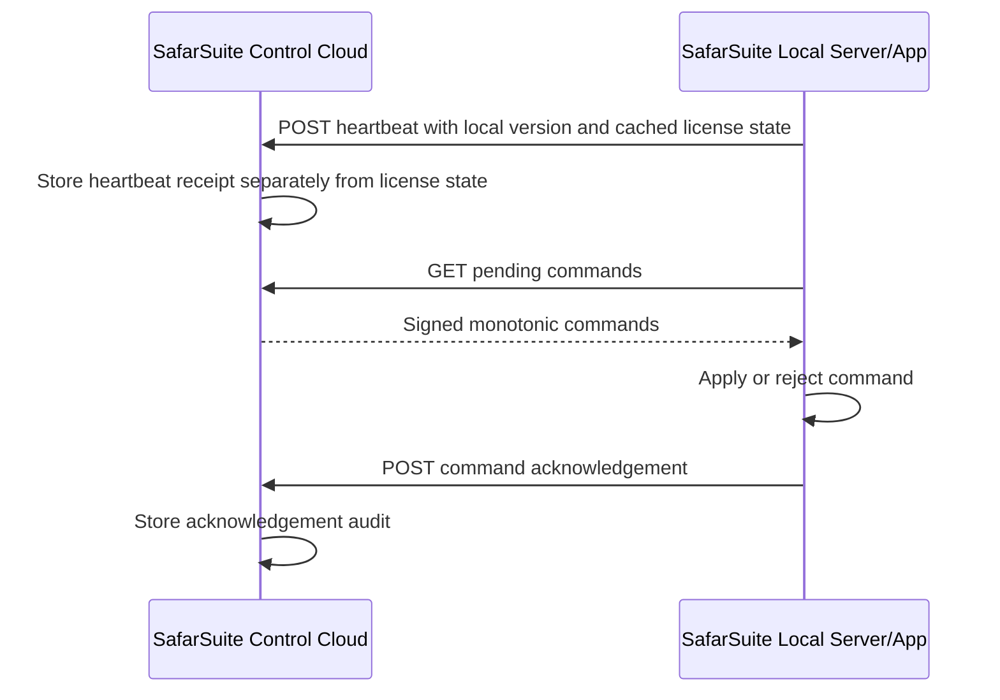

# Cloud And Local Communication Map

Date added: 2026-07-02

Use this as the canonical alignment note for SafarSuite Control Desk, SafarSuite Control Cloud, SafarSuite Client Portal, and deployed SafarSuite local servers.

## System Roles

| System | Role | Owns |
| --- | --- | --- |
| SafarSuite Control Desk | Internal office app | Client setup, contracts, invoices, payments, accounting decisions, entitlement snapshots, local operational truth |
| SafarSuite Control Cloud | Online control plane | Accepted commercial projection, signed entitlement bundles, installation registry, command queue, heartbeat records, cloud audit |
| SafarSuite Client Portal | Client-facing portal | Cloud-owned summaries, invoices/balances, license/deployment visibility, approved client self-service |
| SafarSuite local server/app | Client deployment | Cached signed entitlement, local feature gates, outbound heartbeat, command pull/acknowledgement |

There is one production SafarSuite Control Cloud. Older CloudServer work is reference material only, not a second production cloud.

## Source Of Truth

| Data | Source of truth | Replication path |
| --- | --- | --- |
| Client commercial setup | Control Desk | Signed outbox envelope to Control Cloud |
| Invoice/payment/credit/refund state | Control Desk | Signed outbox envelope to Control Cloud |
| Latest client portal commercial summary | Control Cloud | Projection from accepted Control Desk envelopes |
| Signed entitlement bundle | Control Cloud | Local server pulls over HTTPS and verifies locally |
| License/access decision at runtime | SafarSuite local server/app | Uses cached signed entitlement without requiring heartbeat |
| Heartbeat/last seen | Control Cloud | Local server reports outbound heartbeat |
| Pending local-server commands | Control Cloud | Local server pulls pending commands and acknowledges results |
| Installation control status view | Control Cloud | Control Desk and Client Portal read one shared cloud status response |
| Client Portal sessions | Control Cloud | Client users authenticate to Control Cloud and receive client-scoped sessions |
| Client Portal invitations | Control Cloud | Control Desk requests invites for client contacts through a provider-key-protected cloud endpoint |

## Active Communication Paths

| Direction | Purpose | Endpoint/Boundary | Status |
| --- | --- | --- | --- |
| Control Desk -> Control Cloud | Publish approved commercial/control events | `POST /api/v1/control-desk/messages` | Basic done |
| Control Cloud -> Client Portal | Client commercial summary | `GET /api/v1/client-portal/clients/{clientId}/commercial-summary` | Basic done |
| Control Desk -> Control Cloud | Request client contact portal invitation | `POST /api/v1/clients/{clientId}/contacts/{clientContactId}/portal-invitation` -> `POST /api/v1/client-portal/invitations` | Basic done |
| Local server -> Control Cloud | Pull latest signed entitlement bundle | `GET /api/v1/local-server/installations/{installationId}/entitlement-bundle?clientId={clientId}` | Basic done |
| Control Cloud admin -> Control Cloud | Queue installation command | `POST /api/v1/control-cloud/clients/{clientId}/installations/{installationId}/commands` | Basic done |
| Local server -> Control Cloud | Pull pending installation commands | `GET /api/v1/local-server/installations/{installationId}/commands/pending` | Basic done |
| Local server -> Control Cloud | Acknowledge command result | `POST /api/v1/local-server/installations/{installationId}/commands/{commandId}/acknowledgement` | Basic done |
| Local server -> Control Cloud | Report heartbeat and current cached license state | `POST /api/v1/local-server/installations/{installationId}/heartbeat` | Basic done |
| Control Desk/Client Portal -> Control Cloud | Read installation heartbeat, license, entitlement, and command status | `GET /api/v1/control-cloud/clients/{clientId}/installations/{installationId}/status` and `GET /api/v1/client-portal/clients/{clientId}/installations/{installationId}/status` | Basic portal preview done |
| Control Cloud/Support -> Local server | Offline renewal file fallback | Signed renewal file import/export | Pending fallback |

## License And Heartbeat Rule

```text
heartbeat status != license validity
```

Heartbeat means the deployed local server is communicating with SafarSuite Control Cloud.

License validity comes from the signed entitlement bundle cached by the SafarSuite local server/app.

A paid offline-capable client must keep working through the signed entitlement period even when heartbeat is unavailable. Warnings, grace, restriction, and expiry come from the signed entitlement dates, not from missed heartbeat alone.

## Current License Flow



## Current Heartbeat And Command Flow



## Guardrails For Future Work

- Do not call Control Cloud inside accounting transactions. Use durable outbox messages.
- Do not treat missed heartbeat as automatic license failure.
- Do not let SafarSuite local runtime depend on portal screens; it must verify signed bundles locally.
- Do not mix client business-data sync with billing/license control.
- Every entitlement issue, command, acknowledgement, heartbeat, renewal file, and support override must be audited.
- Offline renewal files are fallback only. Direct outbound cloud pull is the normal path.
- Registration-bound entitlement pull is separated from Client Portal sessions; installation registration/setup tokens still need to be added.
- Client Portal credentials must remain cloud-owned; Control Desk can trigger invitations for contacts but should not store client passwords.

## Current Status View

Control Cloud exposes one shared status response for Control Desk and Client Portal through:

```text
GET /api/v1/control-cloud/clients/{clientId}/installations/{installationId}/status
```

It reports installation identity, latest heartbeat, reported license state, latest signed entitlement issue, pending command count, and latest command acknowledgement summary. The SafarSuite Control Desk client page has a minimal manual refresh panel, and the first SafarSuite Client Portal preview consumes the same cloud status through its portal route.

## Next Alignment Slice

Add email delivery, invitation revoke/resend/list, and portal/session audit, then continue toward offline renewal file fallback without changing local license enforcement.
