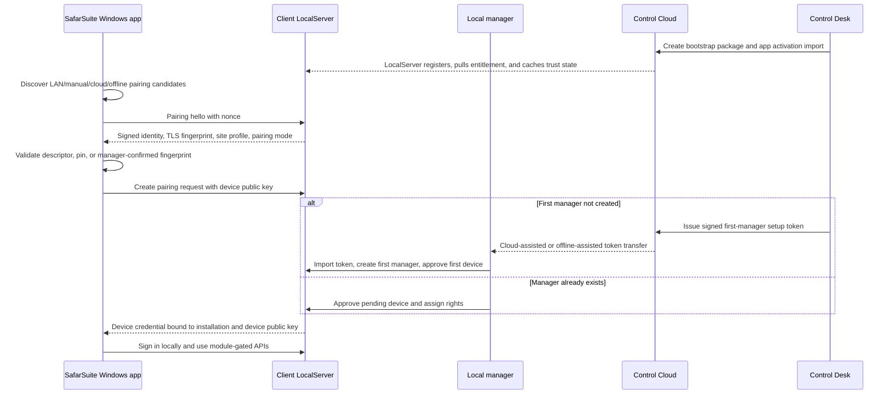

# SafarSuite App To Local Server Pairing Flow

Date added: 2026-07-09

Status: Windows app v1/manual discovery, native LAN candidate generation, UDP broadcast discovery, protected pairing storage, signed descriptor handoff, manager recovery, LocalServer credential refresh, and pre-login credential maintenance wired; unrecognized-device abuse controls are recorded for later security hardening; mDNS/DNS-SD remains optional

Purpose: define how a SafarSuite Windows app finds, trusts, activates against, and keeps using the client-site LocalServer without repeated client-side setup.

## Progress

- [x] Capture the pairing design and vocabulary.
- [x] Add shared discovery, hello, device-request, and pairing-profile contract records.
- [x] Add LocalServer discovery and hello endpoints:
  `GET /.well-known/safarsuite-local-server` and `POST /api/v1/local-server/pairing/hello`.
- [x] Extend the Compose bootstrap proof runner so the runtime proof validates pairing discovery and hello identity after bootstrap import.
- [x] Add pending device request storage, pending-device listing, approval, suspension, revocation, and one-time proof credential issue on approval.
- [x] Add first-manager setup-token import/consume on LocalServer with one-time replay protection and first-device approval.
- [x] Add Control Cloud/Control Desk first-manager setup-token issue/download flow.
- [x] Add signed device credentials plus verification endpoint for approved devices.
- [x] Add local manager bearer sessions and require them for device list/approval/suspend/revoke routes.
- [x] Add Control Desk visibility for first device approved and pairing-mode status through heartbeat/status.
- [x] Add Client Portal visibility for first device approved and pairing-mode status.
- [x] Add Windows app v1/manual URL discovery and protected pairing profile storage in the SafarSuite app workspace.
- [x] Add Windows app LAN candidate probing, descriptor import, and fingerprint confirmation UI.
- [x] Add native Tauri LAN candidate generation from local host/network context.
- [x] Add Control Desk customer setup packet pairing descriptor download for cloud-assisted/offline-assisted discovery hints.
- [x] Add Control Cloud-issued signed pairing descriptor export through the bootstrap signing-key lane.
- [x] Add manager-gated LocalServer live pairing descriptor export for support/replacement handoff.
- [x] Add explicit provider-assisted manager recovery token purpose and Control Desk ceremony.
- [x] Add LocalServer device credential refresh so approved devices can rotate credentials without repeating setup.
- [x] Add native Windows UDP broadcast discovery for deployment networks that need active service discovery beyond DNS/subnet candidates.
- [ ] Add unrecognized-device abuse controls: rate limits, pending-request caps, duplicate coalescing, request-size limits, quarantine/deny controls, and observability for noisy LAN clients.
- [ ] Add native Windows mDNS/DNS-SD service browsing only if customer networks need multicast DNS advertisements.

## App Workspace Verification - 2026-07-09

Verified app workspace:

```text
C:\Users\Daniyal\Documents\Codex\2026-06-09\hello-there-2
```

Completed in the app workspace:

- Windows client now prefers `GET /.well-known/safarsuite-local-server` and `POST /api/v1/local-server/pairing/hello` before legacy discovery.
- Windows client asks the Tauri shell for native LAN candidate URLs from loopback names, local machine names, default SafarSuite LAN names, and likely private-subnet gateway/static hosts before probing each candidate.
- Windows client pairing requests/status calls prefer `/api/v1/local-server/pairing/...` and fall back to the older app-local routes.
- Windows client pairing profiles retain server URL candidates, last-seen time, LocalServer installation id, fingerprint, server pairing key hash, TLS hash placeholders, device credential metadata, and a local private-key reference.
- Tauri protected storage now writes the local-client secret as a Windows DPAPI current-user JSON envelope and still reads legacy plaintext payloads.
- App LocalServer exposes v1 pairing hello, v1 pairing request/status aliases, v1 device list/action aliases, and `POST /api/v1/local-server/device-credentials/verify`.
- App LocalServer now exposes non-authoritative UDP discovery on `LocalServerDiscovery:UdpPort` (default `5280`), and Tauri `discover_local_servers` emits `NativeBroadcast` candidates from UDP responses while still requiring HTTP identity validation and fingerprint confirmation before trust.
- Windows client live discovery smoke exercises the native-candidate merge path against the Docker LocalServer, then requires fingerprint confirmation before writing trust.
- Installed Windows client discovery smoke drives the packaged pre-login DOM over WebView2 CDP, starts from a dead URL, scans LAN candidates, confirms the Docker LocalServer fingerprint, and writes trust.
- Windows client pairing smoke proves descriptor import pins the app LocalServer fingerprint, rejects mismatched descriptor fingerprints before trust, reuses the approved device credential without repeating setup, and blocks revoked credentials client-side.
- Windows client pre-login pairing profile refresh now verifies the trusted LocalServer identity, verifies/refreshes stored approved device credentials, persists rotated credential metadata, and can consume an already-approved pending request before sign-in without creating a new pairing request.
- Installed Windows client pairing smoke drives the packaged pre-login DOM against a deterministic v1 LocalServer stub, creates one pending device request, approves it, stores the issued credential, relaunches the installed app, and signs in again without repeating setup.
- Installed Windows client Docker pairing smoke activates an isolated Compose LocalServer, bootstraps a real manager device/admin, approves the installed app through the Docker manager API, stores the Docker-issued credential, relaunches, and signs in again without adding another device row.

Verified commands:

```powershell
cargo check --manifest-path apps/windows-client/src-tauri/Cargo.toml
npm run build
npm run smoke:client-pairing
dotnet build SafarSuite.sln --no-restore
dotnet run --project tests\ProductKernelGuardSmoke\ProductKernelGuardSmoke.csproj --no-build
docker compose -f docker-compose.runtime.yml up -d --build safarsuite-app
npm run smoke:local-discovery
npm run smoke:installed-discovery
npm run smoke:installed-pairing
npm run smoke:installed-docker-pairing
npm run tauri -- build
node --check apps/windows-client/scripts/installed-docker-pairing-cdp-smoke.mjs
```

Docker runtime proof:

- `GET http://localhost:5280/.well-known/safarsuite-local-server` returned `safarsuite-local-server-discovery-v1`.
- `POST http://localhost:5280/api/v1/local-server/pairing/hello` returned `safarsuite-local-server-pairing-hello-v1` and echoed the client nonce.
- `POST http://localhost:5280/api/v1/local-server/device-credentials/verify` returned the v1 verification contract with invalid-credential reasons for a dummy credential.
- `tests\ProductKernelGuardSmoke` passed 42 checks.
- `npm run smoke:local-discovery` proved native-candidate discovery against the running Docker LocalServer, and `npm run tauri -- build` produced MSI and NSIS installers.
- A loopback UDP probe against an in-memory LocalServer returned `safarsuite-local-server-discovery-response-v1`, and `docker compose -f docker-compose.runtime.yml config` rendered both TCP and UDP app port mappings.
- `npm run smoke:installed-discovery` proved the installed desktop UI can scan from a dead URL, select the Docker LocalServer, verify the fingerprint confirmation panel, and persist confirmed trust.
- `npm run smoke:installed-pairing` proved the installed desktop UI can create a pending device request, receive an approved device credential, sign in, relaunch, verify the stored credential, and sign in again without creating a second pairing request.
- `npm run smoke:installed-docker-pairing` proved the installed desktop UI against an activated temporary Docker LocalServer with real first-manager bootstrap, first-admin creation, manager-session approval, Docker-issued client credential storage, relaunch reuse, pre-login `lastCredentialVerifiedAt` advancement before second sign-in, and temporary Compose cleanup.
- The standing Docker runtime volume was missing `platform.local_server_identity.activation_issue_id`; applying only idempotent `migrations/local/platform/0007_add_app_activation_revocation_metadata.sql` fixed the rebuilt image without applying the whole empty-ledger migration set.

## Decision Summary

Pairing is a LocalServer-owned, manager-approved trust ceremony.

Discovery is only a convenience. LAN broadcast, manual URL entry, Control Cloud lookup, QR codes, and imported files may all produce LocalServer candidates, but the app must not trust a candidate until it validates a signed or pinned identity and the local manager approves the device.

The durable result of pairing is a local pairing profile on the Windows device:

```text
LocalServer trust pins
  + approved device credential
  + local user/session flow
  + last good LAN address candidates
```

After that, the app reconnects silently whenever it can prove it is still talking to the same approved LocalServer installation. DHCP/IP changes should not force a setup repeat.

## Vocabulary

| Term | Meaning |
| --- | --- |
| LocalServer | The client-site LAN authority installed from the Control Cloud bootstrap package. It owns local users, devices, roles, module gateway checks, local sessions, and local audit. |
| SafarSuite Windows app | The end-user desktop client installed on office machines. It talks to LocalServer over LAN and never receives database credentials. |
| App activation import | The Control Cloud-issued, provider-controlled signed payload that activates the SafarSuite app/runtime for a registered client installation. This is not the same as device pairing. |
| Pairing descriptor | A safe-to-share descriptor containing candidate LAN URLs, installation identity, site profile, and trust fingerprints. It never contains setup-token plaintext, database secrets, provider keys, or reusable activation tokens. |
| Pairing request | A LocalServer record created when an unpaired Windows device asks to join. It contains device public key and diagnostics, then waits for manager approval. |
| Device credential | A LocalServer-issued credential bound to one Windows device public key, one client, and one installation. It is stored in protected client storage and can be revoked locally by a manager. |
| First-manager setup token | A signed, one-time bootstrap token that can create the first local manager/admin and approve the first device when no manager exists yet. It is bound to the installation and pending device. |
| Pairing profile | The client-side durable profile that stores trust pins, approved device id, device credential, private-key reference, and URL candidates. |

## Product Rules

- The Windows app talks to LocalServer for runtime access. It does not call Control Cloud to decide module/license access.
- The Windows app never receives PostgreSQL credentials, Control Cloud provider credentials, setup-token plaintext, or LocalServer server-side secrets.
- LAN discovery is untrusted input. Trust comes from a signed descriptor, a previous pin, or a manager-confirmed fingerprint ceremony.
- Provider-controlled activation signs and revokes the deployed app/runtime. Local manager-controlled pairing approves devices and local users.
- Managers can approve, revoke, suspend, retire, and rename devices; create users; assign local roles; reset local user access; and view local audit.
- Managers cannot alter installation identity, provider trust roots, activation signing keys, paid modules, license dates, app activation issues, provider contracts, pricing, invoices, or Control Cloud truth.
- First setup is allowed to be guided. Normal office use after successful pairing must not ask the same device to re-import setup files or repeat manager approval.
- Unapproved devices are untrusted LAN callers. Discovery and pairing endpoints must stay cheap, bounded, auditable, and rate-limited before production security tightening is complete.

## Security Hardening Backlog

Per-device pairing is the correct product shape because it gives LocalServer a separate trust record for every workstation: one device can be approved, revoked, suspended, refreshed, or audited without affecting other approved devices. It also keeps database credentials and provider credentials away from desktop clients.

The risk is that unauthenticated or not-yet-approved LAN callers can still reach discovery, hello, pairing-request, pairing-status, and login-adjacent endpoints. A malicious or broken script on the same network could repeatedly submit pairing requests, poll status, or send oversized/noisy requests. That could waste CPU, grow pending-device storage and logs, clutter the manager queue, consume connection slots, and make support diagnostics noisy even though it should not grant access.

Later security tightening should add:

- Per-IP, per-device-install-id, per-fingerprint, and per-endpoint rate limits for unauthenticated discovery/pairing routes.
- A bounded pending-device queue with TTL cleanup, duplicate request coalescing, and one active pending request per device install id/fingerprint where possible.
- Request body size limits, connection limits, short unauthenticated timeouts, and cheap validation before any signing, database write, or expensive work.
- Exponential backoff or temporary quarantine for repeated failed pairing, bad pairing-secret, bad credential, or bad login attempts.
- Manager-visible noisy-device indicators with approve/block/quarantine actions, without letting noise hide already-approved devices.
- Structured metrics/audit for rejected, throttled, duplicate, expired, and quarantined pairing attempts.
- Optional reverse-proxy or Kestrel limits in generated deployment templates so abuse controls exist below the application layer too.

## Flow Overview



## Discovery Modes

Discovery finds candidates. It does not complete trust.

### LAN Discovery

The app should try local discovery first because that is the normal office path.

Preferred mechanisms:

- mDNS/DNS-SD service such as `_safarsuite-local._tcp`.
- Local DNS name from the deployment profile, for example `safarsuite-branch01.lan`.
- DHCP-reserved host name or saved URL from a previous pairing profile.

Broadcast metadata must stay non-secret:

```json
{
  "formatVersion": "safarsuite-local-discovery-v1",
  "displayName": "SafarSuite - Main Office",
  "installationIdHint": "office-main",
  "siteId": "main",
  "siteRole": "Standalone",
  "httpsUrl": "https://safarsuite-branch01.lan:8080",
  "pairingMode": "ManagerApproval",
  "tlsCertificateSha256": "short-or-full-sha256",
  "serverPairingKeySha256": "short-or-full-sha256"
}
```

The app may list discovered candidates, but it must still run the trust ceremony before creating a pairing request.

### Manual Discovery

Manual setup is the fallback when LAN discovery is blocked.

Allowed manual inputs:

- Local DNS name.
- LAN IP plus port.
- QR code from LocalServer setup screen.
- Pairing descriptor JSON imported from a file.

Manual entry should immediately fetch a LocalServer hello response and show a verification screen. The app should not silently trust a typed IP address.

### Cloud-Assisted Mode

Cloud-assisted mode helps the client find the correct LocalServer without making Control Cloud a runtime gate.

Possible entry points:

- Client enters customer code plus installation/site code.
- Client signs in to Client Portal.
- Provider sends a short-lived setup link that opens a pairing descriptor.

Control Cloud may return a signed pairing directory:

```json
{
  "formatVersion": "safarsuite-local-pairing-directory-v1",
  "clientId": "client-guid",
  "installationId": "office-main",
  "siteId": "main",
  "siteRole": "Standalone",
  "displayName": "SafarSuite - Main Office",
  "lanUrlCandidates": [
    "https://safarsuite-branch01.lan:8080",
    "https://192.168.10.20:8080"
  ],
  "tlsCaSha256": "sha256",
  "serverPairingKeySha256": "sha256",
  "generatedAtUtc": "2026-07-09T00:00:00Z",
  "expiresAtUtc": "2026-07-10T00:00:00Z",
  "signature": "cloud-signature"
}
```

This directory is only a signed hint. The app still connects over LAN, validates the LocalServer hello, creates a local pairing request, and waits for manager approval.

### Offline-Assisted Mode

Offline-assisted mode uses the same pairing protocol without internet.

Allowed transfer artifacts:

- Pairing descriptor JSON or QR from the LocalServer setup page or Control Desk customer setup packet.
- First-manager setup token JSON, if no local manager exists yet.
- Offline renewal file for entitlement extension, handled by the existing entitlement import flow.

The offline packet must not contain:

- Control Cloud setup-token plaintext after server bootstrap has been completed.
- Provider bearer sessions or provider shared secrets.
- Local database credentials.
- Reusable app activation signing keys.

## Trust Ceremony

The app must prove that the candidate LocalServer is the intended installation before it submits a device request.

Draft unauthenticated endpoints:

```text
GET  /.well-known/safarsuite-local-server
POST /api/v1/local-server/pairing/hello
```

`hello` request:

```json
{
  "formatVersion": "safarsuite-local-pairing-hello-request-v1",
  "clientNonce": "base64url",
  "appVersion": "1.0.0",
  "requestedBy": "windows-app"
}
```

`hello` response:

```json
{
  "formatVersion": "safarsuite-local-pairing-hello-v1",
  "clientId": "client-guid",
  "installationId": "office-main",
  "bootstrapPackageId": "package-guid",
  "deploymentProfile": {
    "clientDeploymentMode": "OfflineLocal",
    "siteId": "main",
    "siteRole": "Standalone",
    "branchCode": "MAIN"
  },
  "displayName": "SafarSuite - Main Office",
  "localServerVersion": "1.0.0",
  "pairingMode": "ManagerApproval",
  "tlsCertificateSha256": "sha256",
  "tlsCaSha256": "sha256",
  "serverPairingPublicKey": "pem-or-jwk",
  "serverNonce": "base64url",
  "clientNonce": "base64url",
  "entitlementVersion": 42,
  "signedAtUtc": "2026-07-09T00:00:00Z",
  "signature": "localserver-signature"
}
```

Validation rules:

- If a cloud/offline descriptor is present, the `clientId`, `installationId`, URL candidate, TLS fingerprint, and server pairing key must match it.
- If a previous pairing profile exists, the LocalServer must match the pinned installation id and trust pins.
- If neither exists, first-use trust is allowed only through manager confirmation of a short fingerprint code shown by both the app and LocalServer setup/Device Manager screen.
- If the TLS certificate changes but the server pairing key and installation id remain valid, the app may refresh the TLS pin after manager confirmation.
- If the installation id changes, treat it as a different server and require a new provider/manager-assisted setup.

## One-Time Activation And First Pairing

There are two separate one-time ceremonies.

### Provider App Activation

The existing Control Cloud app activation import activates the deployed SafarSuite app/runtime for the registered client installation. It is issued through Control Desk/Control Cloud, recorded in the activation issue register, and revocable through signed LocalServer commands.

This remains provider controlled. Client managers do not issue or edit app activation tokens.

### Device Pairing

Device pairing activates one Windows device locally.

Draft request:

```text
POST /api/v1/local-server/pairing/requests
```

```json
{
  "formatVersion": "safarsuite-local-device-pairing-request-v1",
  "installationId": "office-main",
  "deviceDisplayName": "Reception PC",
  "devicePublicKey": "pem-or-jwk",
  "deviceFingerprintHash": "privacy-preserving-hash",
  "windowsUserHint": "frontdesk",
  "appVersion": "1.0.0",
  "helloServerNonce": "base64url",
  "helloClientNonce": "base64url",
  "requestedAtUtc": "2026-07-09T00:00:00Z"
}
```

LocalServer stores the request as `Pending` and shows it in Device Manager.

If a manager already exists, an approved manager signs in locally and approves the pending device.

If no manager exists, the first-manager setup token path is required.

## First-Manager Setup Token

The first-manager setup token should be signed by Control Cloud and consumed by LocalServer exactly once.

Minimum claims:

```json
{
  "formatVersion": "safarsuite-first-manager-setup-token-v1",
  "clientId": "client-guid",
  "installationId": "office-main",
  "pendingDeviceRequestId": "request-guid",
  "allowedActions": [
    "CreateFirstManager",
    "ApproveFirstDevice"
  ],
  "managerDisplayName": "Owner",
  "managerEmail": "owner@example.com",
  "createdBy": "provider-operator",
  "issuedAtUtc": "2026-07-09T00:00:00Z",
  "expiresAtUtc": "2026-07-10T00:00:00Z",
  "tokenId": "token-guid",
  "signature": "cloud-signature"
}
```

Consumption rules:

- LocalServer verifies Control Cloud signature against the bootstrapped trust root.
- Token must match the current `clientId`, `installationId`, and pending device request id.
- Token must be unexpired and unused.
- Token creates exactly one first manager/admin user and approves exactly one first device.
- Token consumption is audited locally and, when online, reported to Control Cloud.
- Reusing the token returns an explicit `AlreadyConsumed` result and does not alter local state.

Cloud-assisted delivery can use Client Portal or Control Desk download.

Offline-assisted delivery uses a JSON file or QR code from the customer setup packet.

## Manager-Controlled Rights

Local managers own the local access list after first setup.

Device states:

| State | Meaning |
| --- | --- |
| Pending | Device has requested pairing and is waiting for approval. |
| Approved | Device has a valid LocalServer-issued credential. |
| Suspended | Temporarily denied without deleting history. |
| Revoked | Credential is permanently invalid; rejoin requires a new request. |
| Blocked | Device fingerprint or key is refused before approval. |
| Retired | Device removed from normal use after replacement or decommission. |

Manager actions:

- Approve or reject pending devices.
- Set device display name, branch/site scope, and optional expiry.
- Revoke or suspend compromised devices.
- Create local users and assign roles.
- Reset local user credentials through local policy.
- View pairing, login, device, role, and revocation audit.

Provider-owned actions remain outside manager control:

- Enabling paid modules.
- Increasing contracted device/user/branch limits beyond entitlement.
- Changing paid-through, warning, grace, or offline-valid dates.
- Replacing installation identity.
- Issuing or revoking provider app activation issues.
- Changing provider signing keys or trust roots.

LocalServer enforces both chains:

```text
device approval + local user role
  must pass before local workflow access

signed entitlement + module gateway
  must pass before paid module access
```

## Runtime Reconnect

The app stores the pairing profile in protected client storage.

Minimum stored values:

```json
{
  "formatVersion": "safarsuite-local-pairing-profile-v1",
  "clientId": "client-guid",
  "installationId": "office-main",
  "siteId": "main",
  "approvedDeviceId": "device-guid",
  "devicePrivateKeyRef": "os-protected-key-reference",
  "deviceCredential": "localserver-issued-credential",
  "serverPairingKeySha256": "sha256",
  "tlsCaSha256": "sha256",
  "tlsCertificateSha256": "sha256",
  "lastGoodUrl": "https://safarsuite-branch01.lan:8080",
  "urlCandidates": [
    "https://safarsuite-branch01.lan:8080",
    "https://192.168.10.20:8080"
  ],
  "approvedAtUtc": "2026-07-09T00:00:00Z",
  "lastSeenAtUtc": "2026-07-09T00:00:00Z"
}
```

Reconnect rules:

- Try `lastGoodUrl` first.
- If it fails, run LAN discovery and accept only candidates matching the pinned installation id and trust pins.
- If the LAN IP changed but trust pins match, update `lastGoodUrl` silently.
- If the TLS certificate changed but the pinned CA or pairing key still proves continuity, require manager confirmation before refreshing the certificate pin.
- If the device credential is revoked, show the revoked state and create a new pairing request only after manager action.
- If the LocalServer was replaced, require a new signed descriptor or first-manager/provider-assisted migration. Do not silently bind to a new installation id.

## Draft Endpoint Set

Public or pre-pairing:

```text
GET  /.well-known/safarsuite-local-server
POST /api/v1/local-server/pairing/hello
POST /api/v1/local-server/pairing/requests
GET  /api/v1/local-server/pairing/requests/{pairingRequestId}
POST /api/v1/local-server/pairing/first-manager-token/import
```

Manager-protected:

```text
GET  /api/v1/local-server/devices
GET  /api/v1/local-server/devices/pending
POST /api/v1/local-server/devices/{deviceId}/approve
POST /api/v1/local-server/devices/{deviceId}/suspend
POST /api/v1/local-server/devices/{deviceId}/revoke
POST /api/v1/local-server/users
POST /api/v1/local-server/users/{userId}/roles
GET  /api/v1/local-server/audit/device-access
```

Device-protected:

```text
POST /api/v1/local-server/device-credentials/verify
POST /api/v1/local-server/pairing/manager-sessions
POST /api/v1/local-server/sessions/login
POST /api/v1/local-server/sessions/refresh
POST /api/v1/local-server/device-credentials/refresh
GET  /api/v1/local-server/modules/{moduleCode}/access
```

`POST /api/v1/local-server/pairing/manager-sessions` accepts an approved manager-capable signed device credential and returns a short-lived bearer token. The manager-protected device routes require that bearer token; request-body actors are not trusted as authority.

These endpoint names are draft contract names. The real app workspace should own the Windows UI, while this workspace should own shared contracts and LocalServer authority behavior.

## Device Credential Refresh

Approved Windows devices should refresh LocalServer credentials silently during startup/reconnect and before expiry. The default LocalServer device credential lifetime is 3650 days, with refresh enabled during the final 30 days and a 24-hour grace period for the previous credential after rotation.

`POST /api/v1/local-server/device-credentials/refresh` accepts the current credential in `deviceCredential`, `X-SafarSuite-Device-Credential`, or `Authorization: Bearer`. LocalServer verifies the signed credential, client id, installation id, device id, pairing request id, protected public-key hash, local device status, and stored credential hash before it returns a result.

If the current credential is outside the refresh window, the endpoint returns `rotated: false` with the current credential metadata and no replacement secret. If the credential is within the refresh window, or if the caller is still using the previous credential during grace, LocalServer issues a new signed compact credential, stores its hash, records the previous credential id/hash until the grace deadline, and returns `rotated: true` with the new credential for protected client storage.

This keeps approved devices on a one-time pairing model. The user does not repeat setup for ordinary expiry rotation; manager/provider involvement is only needed when the credential is revoked, expired beyond grace, bound to a replaced LocalServer installation id, or the local protected client profile is lost.

## Cloud-Assisted Behavior

Cloud-assisted mode should improve setup guidance without changing runtime authority.

Allowed cloud help:

- Return signed pairing directories for a known client/site.
- Let Control Desk or Client Portal download first-manager setup tokens.
- Show setup progress: registered, heartbeat, entitlement pulled, diagnostics received, app activation issued, first device approved.
- Reissue app activation imports or first-manager tokens when a previous one expires unused.
- Queue signed commands for diagnostics, entitlement refresh, and activation revocation.

Not allowed:

- Control Cloud must not approve daily runtime device access directly.
- The app must not use Control Cloud as its normal module/license gate.
- Cloud lookup must not replace local manager approval.
- Cloud must not require inbound firewall access to the client office.

## Offline-Assisted Behavior

Offline-assisted mode must be a first-class path for poor internet sites.

Offline packet contents:

- Pairing descriptor.
- First-manager setup token if needed.
- LocalServer URL guidance and fingerprint verification instructions.
- Offline renewal file if the entitlement needs extension.

Offline packet exclusions:

- Bootstrap setup-token plaintext after installation registration.
- Provider operator credentials.
- Local API shared secrets intended only for app-runtime-to-provider-LocalServer service checks.
- Database passwords.
- Signing private keys.

The same LocalServer pairing request, token import, manager approval, device credential, and local audit paths are used in offline mode.

## Control Desk Pairing Descriptor Handoff

Control Desk now downloads a customer-safe descriptor beside the bootstrap guide and signed bundle:

```json
{
  "formatVersion": "safarsuite-local-pairing-descriptor-v1",
  "clientId": "client-guid",
  "providerInstallationId": "office-main",
  "bootstrapPackageId": "package-guid",
  "setupTokenId": "setup-token-guid",
  "displayName": "CUSTOMER - MAIN",
  "appServerInstallationId": "optional-app-localserver-guid",
  "serverInstallationId": "optional-app-localserver-guid",
  "fingerprintHash": "optional-app-localserver-fingerprint",
  "siteId": "main",
  "siteRole": "Standalone",
  "customerCode": "CUSTOMER",
  "branchName": "MAIN",
  "urlCandidates": [
    "http://localhost:5280",
    "http://127.0.0.1:5280",
    "http://safarsuite-main.lan:5280"
  ],
  "generatedAtUtc": "2026-07-09T00:00:00Z",
  "expiresAtUtc": "2026-07-10T00:00:00Z",
  "source": "ControlCloudPairingDescriptor",
  "bootstrapBundleSha256": "sha256",
  "bootstrapSignatureKeyId": "key-id",
  "signatureAlgorithm": "HMAC-SHA256",
  "signatureKeyId": "key-id",
  "payloadSha256": "unsigned-descriptor-payload-sha256",
  "signature": "base64-signature"
}
```

This descriptor is a setup hint, not an authority token. The normal Control Desk Descriptor action calls Control Cloud to resolve the selected bootstrap package and current activation issue, then signs the unsigned descriptor payload through the same bootstrap trust key lane used by the bootstrap bundle and first-manager setup-token. If the current app activation issue is already known, Control Cloud includes the app LocalServer installation id and fingerprint hash so the Windows client can reject the wrong app server before fingerprint confirmation. If the app server is not activated yet, the descriptor intentionally omits those pins and the Windows client falls back to live hello validation plus manager confirmation.

The descriptor must never contain setup-token plaintext, app activation imports, provider sessions, database credentials, Local API access keys, or signing private keys.

## LocalServer Live Pairing Descriptor Export

The installed LocalServer now also exposes `GET /api/v1/local-server/pairing/descriptor` for support, replacement, and no-repeat-setup recovery flows. Unlike `.well-known` discovery and pairing hello, this export is not anonymous: it requires a short-lived local manager bearer session minted from an approved manager-capable device credential.

The live descriptor uses the same `safarsuite-local-pairing-descriptor-v1` contract, with `source` set to `LocalServerLivePairingDescriptor`. It carries the installed client id, LocalServer installation id, bootstrap package/setup ids for correlation, deployment site/profile hints, URL candidates, TLS and server pairing key hashes, bootstrap payload/signing metadata, and a short freshness window based on the local pairing request expiry. It is signed by the installed LocalServer using the local device-credential HMAC signing lane and returns `signatureAlgorithm`, `signatureKeyId`, `payloadSha256`, and `signature`.

The live descriptor must never contain setup-token plaintext, provider sessions, database credentials, app activation imports, activation tokens, local API access keys, device credentials, or signing private keys. The Windows app still treats it as discovery input only and must validate the live hello response plus manager-confirmed fingerprints before writing trust.

## Manager Recovery Ceremony

The first-manager setup-token lane now carries an explicit signed purpose:

- `FirstManagerBootstrap`: the original first-device ceremony. The signed payload allows `CreateFirstManager` and `ApproveFirstDevice`, and LocalServer approves the pending device as `FirstManagerDevice`.
- `ManagerRecovery`: the provider-assisted recovery ceremony. The signed payload requires a recovery reason, allows `RecoverManagerAccess` and `ApproveManagerDevice`, and LocalServer approves the pending device as `ManagerApprovedDevice`.

Recovery flow:

1. The replacement manager device discovers or imports a descriptor for the installed LocalServer and creates a normal pending device request.
2. A provider operator in Control Desk selects `Manager recovery`, enters the pending request id, manager identity, expiry, and recovery reason.
3. Control Desk asks Control Cloud to issue the signed setup token through the existing bootstrap trust key lane.
4. The customer imports the signed token into LocalServer through `POST /api/v1/local-server/pairing/first-manager-token/import`.
5. LocalServer verifies signature, client/install binding, purpose/action pair, expiry, pending request binding, and replay status before approving the recovery device.
6. The recovered manager device receives a signed compact device credential and can mint a short-lived local manager bearer session.

This flow is for lost/replaced manager devices, not silent device takeover. Already-approved client devices keep using their protected pairing profiles and do not repeat setup unless their device credential is revoked, expired, or bound to a replaced LocalServer installation id.

## Failure Cases

| Case | Expected behavior |
| --- | --- |
| Multiple LocalServers found | Show client/site/install hints and require explicit selection plus trust validation. |
| Wrong office selected | Descriptor or manager fingerprint mismatch blocks pairing. |
| MITM on LAN | TLS and pairing key checks fail unless the attacker also has the pinned trust material. |
| Certificate regenerated | Allow refresh only when higher-level LocalServer identity is still proven and manager confirms. |
| Device cloned | Device key and local credential are bound to protected storage; manager can revoke suspicious duplicate use. |
| Device credential near expiry | App calls the refresh endpoint silently; LocalServer rotates the credential and keeps the previous credential valid only for the configured grace period. |
| Manager lost access | Provider-assisted recovery issues a new signed manager recovery/setup token with audit. |
| LocalServer replaced | New installation id requires provider-controlled replacement or migration flow. |
| Device revoked while offline | Device is blocked when it next reaches LocalServer; local audit records the attempt. |
| Entitlement expired | Device can still authenticate, but module gateway returns warning/grace/restricted/expired according to signed entitlement. |

## Implementation Slices

1. Add shared pairing contracts and this design note to the app handoff.
2. Add LocalServer discovery, pairing hello, and manager-gated live descriptor endpoints. Done: `.well-known` discovery and pairing hello are public candidate/trust-probe endpoints, while live descriptor export requires a verified local manager bearer session.
3. Add pending pairing request storage, manager approval commands, device credential issue/revoke, and device audit.
4. Add first-manager setup-token import/consume on LocalServer with token replay protection and first-device approval.
5. Add Control Cloud/Control Desk first-manager setup-token issue/download flow.
6. Add real manager-session protection for local manager approval endpoints. Done: approved device credentials can mint short-lived local manager bearer sessions, and device list/approval/suspend/revoke routes require that session.
7. Add final signed device credential verification on app-to-LocalServer calls. Done for the LocalServer authority: approved devices now receive HMAC-signed compact credentials and can verify them through `POST /api/v1/local-server/device-credentials/verify`.
8. Add silent device credential refresh on LocalServer. Done: approved devices can call `POST /api/v1/local-server/device-credentials/refresh`, rotate within the configured refresh window, keep the previous credential valid during a short grace period, and avoid repeated client setup for normal credential maintenance.
9. Add Windows app LAN discovery, manual URL, descriptor import, and fingerprint confirmation UI in the SafarSuite app workspace. Done for the v1/manual URL path, descriptor import, LAN hostname candidate probing, native Tauri host/subnet candidate generation, UDP broadcast discovery, and explicit fingerprint confirmation: the Windows client now prefers `.well-known` plus pairing hello, stores URL candidates and trust pins, and falls back to legacy discovery. Remaining: true mDNS/DNS-SD service browsing only if customer networks need multicast DNS advertisements.
10. Add protected client storage for pairing profiles and silent reconnect across IP changes. Done for packaged Windows: the Tauri local-client secret is now stored as a Windows DPAPI current-user envelope, with legacy plaintext reads supported and reconnect candidates pinned by server installation/fingerprint/pairing key/TLS hashes.
11. Add Control Desk/Client Portal visibility for first device approved and pairing-mode status. Done: Control Desk and the static Client Portal preview both read the shared installation status pairing snapshot.
12. Add smoke proofs for online pairing, offline-assisted first manager, revoked device, changed IP same trust, changed certificate manager refresh, credential refresh with previous-token grace, and server replacement block.

## Open Decisions

- Final discovery stack: mDNS/DNS-SD first, local DNS first, or both with a feature flag.
- Exact privacy-preserving device fingerprint fields for Windows.
- Whether manager approval should support time-limited guest devices in V1.
